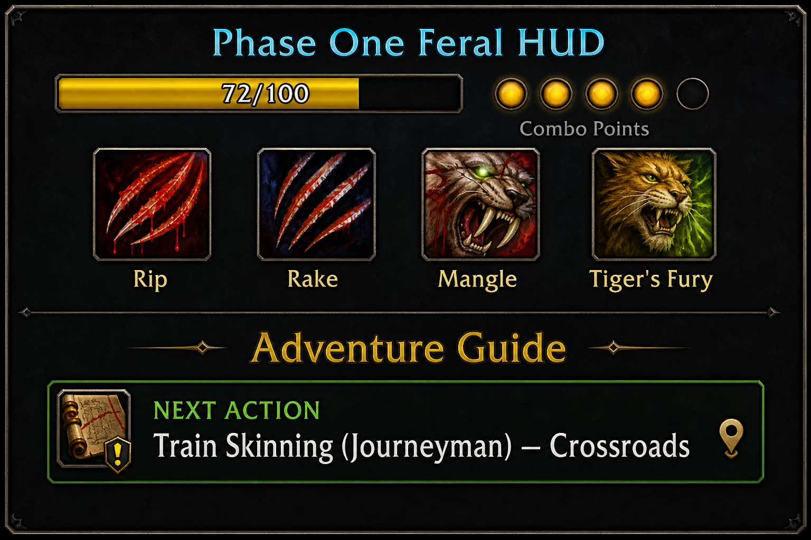
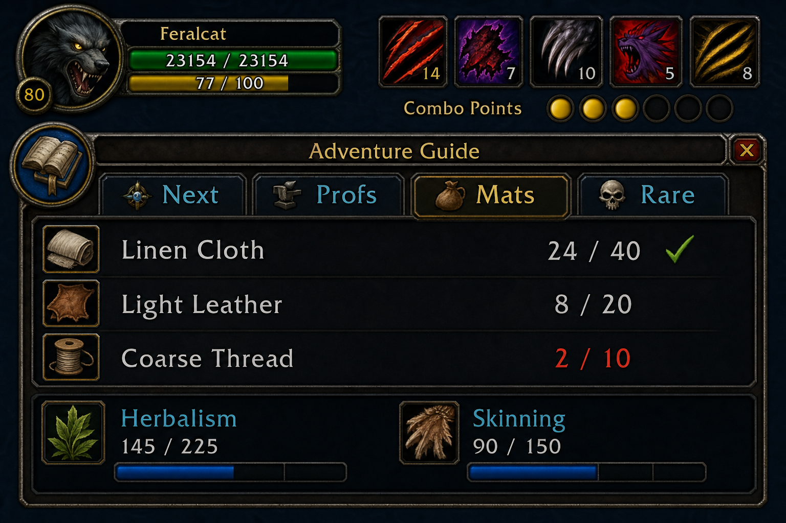

# P1 Adventure Guide — v1.1 (warlock pack; druid pack uses enhanced P1DruidGuide v1.5 with PATH)

Docked below the combat HUD (same Phase One style). Auto-loads on install — no setup.

## UI preview

**Compact (collapsed)** — next action at a glance:

**Expanded** — click **+** for Next / Profs / Mats / Rare tabs:

## Tabs

| Tab | What it shows |
|-----|----------------|
| **Next** | Highest-impact action for your level (prof train, zone move, rotation tip) |
| **Profs** | Live skill levels + Horde leveling profession advice |
| **Mats** | Bag counts vs goals (linen, leather, herbs, thread) |
| **Rare** | Rare mob locations for your current zone |

## Commands

- `/p1guide` — show/hide panel
- `/p1fix` — clear stuck TomTom arrow or pause stuck WeakAuras glows
- Click **+** to expand, **-** to collapse
- Drag with **right-click**

## Install

Included in both packs. Re-run `INSTALL.bat` or enable **P1AdventureGuide** at character select.
