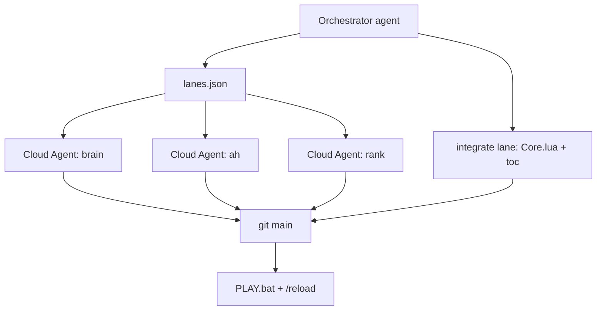

# Cursor multi-agent orchestration

Machine-readable task board + prompts so **one orchestrator** (this chat or you) can run **parallel Cursor Cloud Agents** without file conflicts.

## Quick start

```powershell
# See all lane prompts (open one Cloud Agent tab per lane)
.\tools\orchestrator\emit-prompt.ps1 -All

# Single lane
.\tools\orchestrator\emit-prompt.ps1 -Lane brain

# Mark progress
.\tools\orchestrator\set-status.ps1 -Lane brain -Status done
.\tools\orchestrator\set-status.ps1 -Lane ah -Status in_progress
```

## Architecture



| File | Role |
|------|------|
| `tools/orchestrator/lanes.json` | Lane IDs, owned paths, status |
| `tools/orchestrator/emit-prompt.ps1` | Generate Cloud Agent prompts |
| `tools/orchestrator/set-status.ps1` | Update lane status |
| `.cursor/rules/orchestrator.mdc` | Cursor rule: read lanes before editing |
| `Docs/v2.0/ROADMAP.md` | Product scope for druid v2 |

## Rules

1. **One lane = one agent = one file group** (see `paths` in lanes.json).
2. **Integrate lane runs last** — wires modules into `Core.lua` / toc.
3. **Orchestrator** may only edit integrate + orchestrator tooling — not brain/ah/rank Lua in parallel.
4. After merge: `PLAY.bat` → `/reload`. Agents cannot run the game.

## v2.0 druid lanes (current sprint)

| Lane | Delivers |
|------|----------|
| `brain` | Scan history + session delta |
| `ah` | Shopping list + afford check |
| `rank` | Quest + gear fused NEXT ranking |
| `integrate` | SHOP section, version 2.0.0 |
| `release` | RELEASE.txt, README |

See [v2.0/ROADMAP.md](v2.0/ROADMAP.md).

## Grok handoff (data only)

Research lanes still use `tools/agent-handoff.ps1 -RunGrok` — **no Lua**. Output feeds `brain` / `Data.lua` via orchestrator.