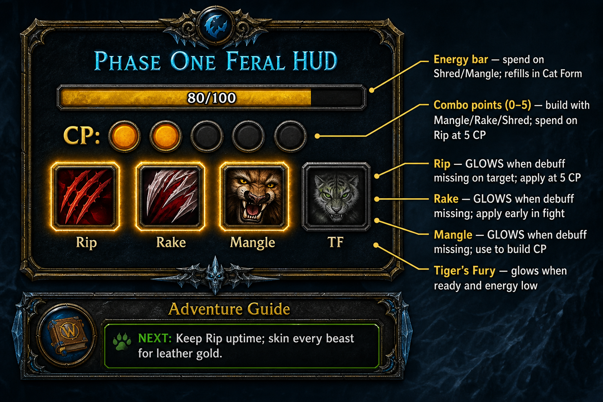
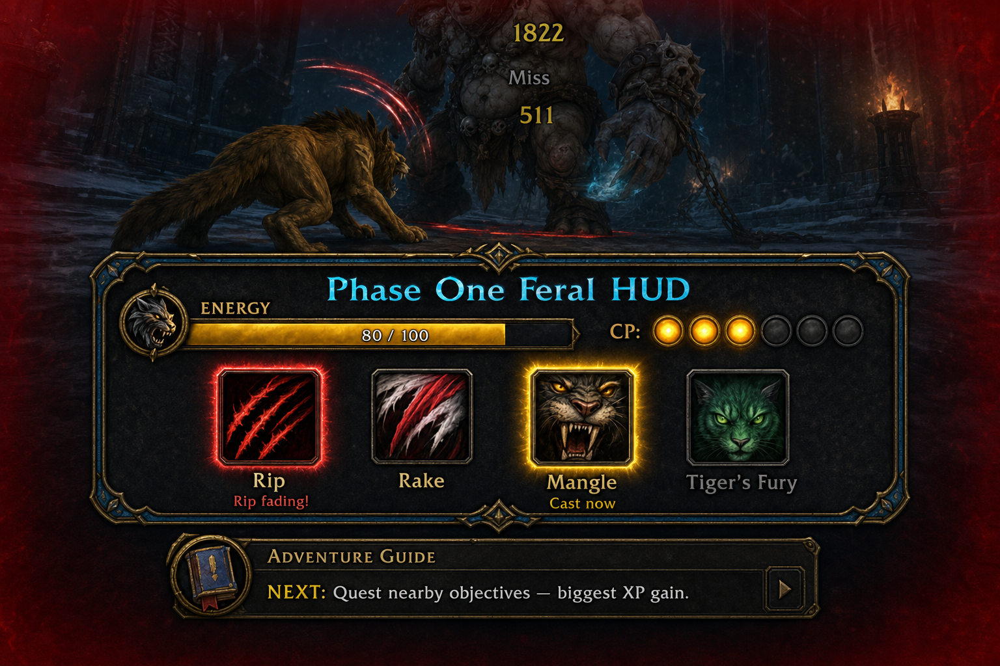

# P1 Feral HUD — what it shows and why

The **P1 Feral HUD** is a small combat panel that sits near the bottom-center of your screen. It replaces WeakAuras setup: it loads automatically with the Druid pack and tells you what to press next during cat-form leveling. The **Adventure Guide** docks directly below it for non-combat leveling tips.

## UI preview

**Annotated layout** — what each piece means:

**In combat** — example state (3 combo points, Rip fading, Mangle ready, 80 energy):

## Elements

| Element | What it means |
|---------|----------------|
| **Energy bar** | Your current energy (0–100 in Cat Form). Spend it on builders (Mangle, Rake, Shred) and finishers (Rip). It refills passively while in Cat Form. |
| **Combo points (CP)** | Five pips; lit = active combo points on your target (0–5). Build CP with Mangle, Rake, and Shred; spend at 5 CP on **Rip**. |
| **Rip / Rake / Mangle icons** | **Glow = cast this** — the debuff is missing on your target. No glow = debuff is already up; keep building CP or refreshing when it fades. |
| **Tiger's Fury (TF)** | Glows when the spell is off cooldown **and** your energy is below 35. Use it for a quick energy burst. |
| **Rejuvenation icon** | Appears only when your health drops below 55% and you do not already have Rejuvenation. A safety net between pulls. |
| **Adventure Guide (below)** | Compact “NEXT:” line for leveling (quests, prof trains, zone moves). Click **+** for Profs / Mats / Rare tabs. |

## Leveling rotation (simple)

1. **Open fight:** Rake → Mangle (both glow when missing).
2. **Build combo points** with Shred (or Mangle if you need CP fast).
3. At **5 CP**, apply **Rip** when it glows.
4. **Refresh** Rake and Mangle whenever their icons glow again.
5. Use **Tiger's Fury** when it glows and you are energy-starved.

The HUD does not pick abilities for you — it highlights what is **missing** so you do not forget debuffs or Rip uptime while questing.

## Commands

- `/p1hud` — show or hide the Feral HUD
- `/p1guide` — show or hide the Druid Guide (v1.5: PATH steps, BIS icons, minimize)
- **Drag** the HUD with left-click; drag the guide with right-click

## Install

Included in **PhaseOne_Druid_LevelingPack**. Enable **P1FeralHUD** and **P1AdventureGuide** at character select, or re-run `INSTALL.bat`.
