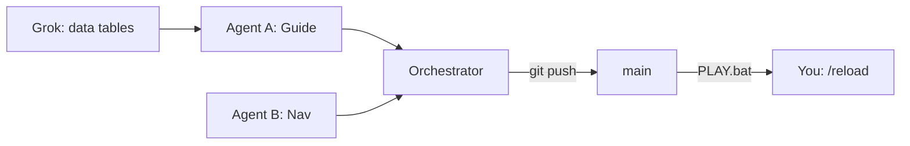

# Task division — Cursor agents (parallel)

Use **separate Cursor Agent / Cloud tasks** on the same repo. All read `AGENTS.md`. You merge via git + **PLAY.bat** → `/reload`.

Last updated: v1.6.1

---

## Agent lanes (file ownership)

| Agent | Owns | Never touches |
|-------|------|---------------|
| **Guide** | `P1DruidGuide/*` | `P1QuestNav`, loader |
| **Nav** | `P1QuestNav/*` (both packs, keep identical) | `P1DruidGuide` |
| **Loader** | `PhaseOneLoader/*` | Questie/TomTom vendored |
| **Release** | `tools/*.ps1`, `RELEASE.txt`, `README.md`, git tag | Addon Lua |
| **Orchestrator** | Merge + version bump + final ship | — |

**Rule:** Parallel agents must not edit the same file. Orchestrator runs last.

---

## v1.6.1 — completed by parallel agents

| Agent | Task | Status |
|-------|------|--------|
| Guide | v1.6 drag, BIS, flavor, GO, autogo | Done (v1.6.0) |
| Nav | Multi-hop minimap trails (top 3 path) | Done |
| Loader | `guideAutoWaypoint` in `/p1settings` | Done |
| Release | Build zips, push, tag | Done (v1.6.1) |

---

## Next sprint — split

### Cursor Agent A (Guide polish)

```
Scope: P1DruidGuide only.
Task: Fix BIS waypoint coords from in-game feedback [paste notes].
Bump 1.6.1 -> 1.6.2 if needed.
```

### Cursor Agent B (Nav)

```
Scope: P1QuestNav both packs (sync).
Task: World map trails for #2/#3 path quests (optional).
```

### Cursor Agent C (Research via Grok)

```
Do NOT edit Lua. Output tables only:
- PATH 50-58 feral upgrades (itemId, source, impact)
- Verify PATH_STEPS spell/item IDs for 3.3.5
```

### Orchestrator (ship)

```
Merge agent branches, bump PACK_VERSION, RELEASE.txt, build-all.ps1,
commit, push, tag, gh release upload.
```

---

## Copy-paste Cloud Agent prompt

```
Repo: Warmane-WoW druid pack.
Read AGENTS.md + Docs/TASK_DIVISION.md.
Task: [ONE scoped task from table above]
Do not edit vendored Questie/TomTom.
User tests: PLAY.bat + /reload.
```

---

## Handoff



See also: [CURSOR_CLOUD.md](CURSOR_CLOUD.md), [GROK_INTEGRATION.md](GROK_INTEGRATION.md).