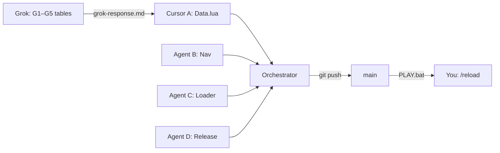

# Task division — Cursor + Grok

Use **Grok for research tables**, **Cursor for Lua/ship**. Parallel Cursor agents use separate file lanes. All read `AGENTS.md`. Merge via git + **PLAY.bat** → `/reload`.

Last updated: v1.6.4 sprint (2026-06-18)

---

## Grok vs Cursor (quick split)

| | **Grok** (sidebar / `agent-handoff.ps1`) | **Cursor** (Agent / Cloud) |
|---|------------------------------------------|----------------------------|
| **Does** | Wowhead-style tables, ID verify, talent/gear research | `P1*` Lua, UI, loader, tools, releases |
| **Writes** | `Docs/grok-handoff/grok-response.md` only | `Interface/AddOns/*`, `tools/*`, `RELEASE.txt` |
| **Never** | Edit `.lua` | Guess item IDs without Questie cross-check |
| **Run** | `.\tools\agent-handoff.ps1 -RunGrok` | Implement `CURSOR_TASKS.md` after Grok |

**Current Grok queue:** [grok-handoff/GROK_TASKS.md](grok-handoff/GROK_TASKS.md) (G1–G5: 58–80 AH, warlock 30–50, consumable audit)

**Paste into Grok sidebar:**

```
Read Docs/grok-handoff/GROK_TASKS.md. Complete G1–G5.
Write grok-response.md + CURSOR_TASKS.md. No Lua.
```

---

## v2.0.0 — druid coach (done)

Parallel lanes via **`tools/orchestrator/`** — see [CURSOR_ORCHESTRATION.md](CURSOR_ORCHESTRATION.md).

| Lane | File(s) | Shipped |
|------|---------|---------|
| brain | `Brain.lua` | Scan history + session delta on `/p1scan` |
| ah | `AhAutopilot.lua` | SHOP section — afford / shortfall |
| rank | `NextRank.lua` | Fused NEXT — gear ROI + quests |
| integrate | `Core.lua`, toc, loader | SHOP section, v2.0.0, login baseline |
| release | `RELEASE.txt`, `README.md` | v2.0.0 changelog |

```powershell
.\tools\orchestrator\emit-prompt.ps1 -All   # next sprint
.\tools\orchestrator\set-status.ps1 -Lane brain -Status in_progress
```

---

## Cursor ↔ Grok (autonomous)

```powershell
.\tools\agent-handoff.ps1 -RunGrok
.\tools\agent-handoff.ps1 -Status
```

Grok writes `Docs/grok-handoff/grok-response.md` → Cursor implements → PLAY.bat. See [grok-handoff/README.md](grok-handoff/README.md).

---

## Agent lanes (file ownership)

| Agent | Owns | Never touches |
|-------|------|---------------|
| **Guide** | `P1DruidGuide/*`, `P1AdventureGuide/*`, `P1WarlockGuide/*` | `P1QuestNav`, loader |
| **Nav** | `P1QuestNav/*`, `P1AutoQuest/*` (both packs — keep identical) | `P1DruidGuide` |
| **Loader** | `PhaseOneLoader/*` (both packs) | Questie vendored |
| **Auction** | `Auctionator/*` (Warmane fixes only), `tools/addons-manifest.txt` (Auctionator line) | P1* guide logic |
| **Release** | `tools/*.ps1`, `RELEASE.txt`, `README.md`, `Docs/MINIMAL_PACK.md`, git tag | Addon Lua |
| **Orchestrator** | Merge + version bump + final ship | — |

**Rule:** Parallel agents must not edit the same file. Orchestrator runs last.

**Note:** TomTom is **not** in the default install anymore — arrow lives in `P1QuestNav/Waypoint.lua` (`P1Waypoint`). Do not re-enable vendored TomTom unless fixing Questie shim bugs.

---

## v1.6.3 — completed

| Agent | Task | Status |
|-------|------|--------|
| Nav | Clone TomTom+Arrow → `P1QuestNav/Waypoint.lua` (`P1Waypoint`) | Done |
| Nav | P1QuestNav + P1AutoQuest use `P1Waypoint`; TomTom off in manifest | Done |
| Guide | `P1DruidGuide/Auction.lua` — AH priority, Auctionator search | Done |
| Guide | NEXT section: AH lines before quests; header `[AH]` | Done |
| Auction | Enable Auctionator in manifest + sync-addons.ps1 | Done |
| Loader | `/p1fix` + `/p1minimal` mention Auctionator, not TomTom | Done |

---

## v1.6.4 sprint — split (parallel)

### Cursor Agent A — Guide (AH polish + endgame)

**Scope:** `PhaseOne_Druid_LevelingPack/Interface/AddOns/P1DruidGuide/*` only.

**Tasks:**
1. Add BIS bracket / `GOLD_AH_BIS` rows for **58–80** (feral pre-raid AH buys) so level-80 toons see `[AH]` in header when gear is missing.
2. Refresh guide when `AUCTION_ITEM_LIST_UPDATE` fires (price lines in NEXT).
3. Optional: `/p1guide ah` toggle to pin AH-first vs quest-first header.
4. Bump `P1DruidGuide.toc` version → `1.6.4` if you ship changes.

**Do not edit:** `P1QuestNav`, `PhaseOneLoader`, `tools/*`.

---

### Cursor Agent B — Nav (waypoint hardening)

**Scope:** `P1QuestNav/*` + `P1AutoQuest/*` in **both** `PhaseOne_LevelingPack` and `PhaseOne_Druid_LevelingPack` (files must stay identical).

**Tasks:**
1. Verify `Waypoint.lua` is byte-identical in both packs; fix drift if any.
2. Questie ctrl+click: confirm `_G.TomTom` shim still works when external TomTom is disabled.
3. Edge case: stuck arrow after zone change — clear `P1Waypoint` on `ZONE_CHANGED_NEW_AREA` if needed.
4. Optional: world-map dotted trail for path #2/#3 (minimap trails already exist).

**Do not edit:** `P1DruidGuide`, vendored Questie.

---

### Cursor Agent C — Loader + settings

**Scope:** `PhaseOneLoader/*` both packs only.

**Tasks:**
1. Add `/p1settings` row: **AH priority in guide** (mirror `guideAhPriority` in loader DB).
2. Wire setting to `P1DruidGuide` (read from `PhaseOneLoaderDB` / `PhaseOneDruidLoaderDB`).
3. Update welcome line: “7 addons” → list Auctionator, no TomTom.

**Do not edit:** Guide Lua beyond reading loader DB keys (coordinate with Agent A if Guide must read new key).

---

### Cursor Agent D — Release + docs

**Scope:** `tools/*`, `RELEASE.txt`, `README.md`, `Docs/MINIMAL_PACK.md`, `Docs/DEV_WORKFLOW.md` only.

**Tasks:**
1. Update install table: **6 core + Auctionator** (no TomTom folder).
2. Document `/p1ah`, AH click flow, “open AH first”.
3. `RELEASE.txt` v1.6.4 changelog from merged agent work.
4. Run `build-all.ps1` / tag after orchestrator merge.

**Do not edit:** Addon Lua.

---

### Agent E — Grok research (no Lua)

**Scope:** `Docs/grok-handoff/` output only. **Run:** `.\tools\agent-handoff.ps1 -RunGrok`

**Tasks (see [GROK_TASKS.md](grok-handoff/GROK_TASKS.md)):**
1. **G1** — Feral 58–80 AH table (`itemId`, slot, `minIlvl`, gold tier)
2. **G2** — Verify v1.6.3 corrected IDs still OK in Questie DB
3. **G3** — Audit `P1DG.AH_TIPS` consumable IDs
4. **G4** — Warlock PATH 30–50 table
5. **G5** — Outland prep 58–60 hints

**Cursor picks up:** `CURSOR_TASKS.md` → Agent A pastes into `Data.lua`

**Do not edit:** Any `.lua` in `Interface/AddOns/`.

---

### Orchestrator (you or one final agent)

```
1. git pull / merge agent branches (resolve only orchestrator-owned files)
2. Bump PACK_VERSION in PhaseOneLoader (both packs)
3. RELEASE.txt + tag v1.6.4
4. git push + gh release upload
5. Remind user: PLAY.bat + /reload
```

---

## Copy-paste Cloud Agent prompts

### Agent A — Guide

```
Repo: Warmane WoW — druid pack.
Read AGENTS.md + Docs/TASK_DIVISION.md (Agent A).
Scope: PhaseOne_Druid_LevelingPack/Interface/AddOns/P1DruidGuide/* ONLY.
Task: Endgame AH priority — add 58-80 BIS/GOLD_AH_BIS rows, refresh prices on AUCTION_ITEM_LIST_UPDATE, optional /p1guide ah toggle.
Do not edit P1QuestNav, PhaseOneLoader, or tools.
User tests: PLAY.bat + /reload + open AH in Orgrimmar.
```

### Agent B — Nav

```
Repo: Warmane WoW.
Read AGENTS.md + Docs/TASK_DIVISION.md (Agent B).
Scope: P1QuestNav + P1AutoQuest in BOTH packs (keep Waypoint.lua identical).
Task: Harden P1Waypoint — Questie TomTom shim, zone-change arrow clear, sync both packs.
Do not edit P1DruidGuide or vendored Questie.
User tests: PLAY.bat + /reload + Questie ctrl+click map icon.
```

### Agent C — Loader

```
Repo: Warmane WoW.
Read AGENTS.md + Docs/TASK_DIVISION.md (Agent C).
Scope: PhaseOneLoader/* both packs ONLY.
Task: /p1settings toggle for guide AH priority; update /p1minimal addon list (Auctionator yes, TomTom no).
Coordinate: new DB key name for Agent A to read.
Do not edit P1QuestNav or P1DruidGuide logic (loader DB only unless A asks).
```

### Agent D — Release

```
Repo: Warmane WoW.
Read AGENTS.md + Docs/TASK_DIVISION.md (Agent D).
Scope: tools/*, RELEASE.txt, README.md, Docs/MINIMAL_PACK.md, Docs/DEV_WORKFLOW.md ONLY.
Task: Document v1.6.4 pack (P1Waypoint embedded, Auctionator on, /p1ah). No TomTom in default install.
Do not edit Interface/AddOns Lua.
```

### Agent E — Grok

```
Read Docs/grok-handoff/GROK_TASKS.md (tasks G1–G5).
Do NOT edit Lua. Write grok-response.md + CURSOR_TASKS.md.
Cross-check IDs in Questie-335/Database/Wotlk/wotlkItemDB.lua.
Feral 58–80 AH table + warlock 30–50 PATH + AH_TIPS audit.
```

---

## Handoff



See also: [CURSOR_CLOUD.md](CURSOR_CLOUD.md), [GROK_INTEGRATION.md](GROK_INTEGRATION.md).